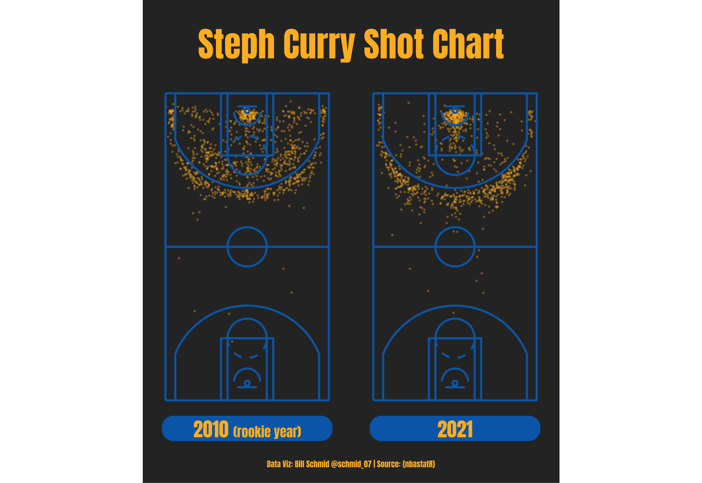

## Steph Curry Shot Chart (submitted as part of 30-day chart challenge)

[**Code**](https://github.com/schmid07/NBA-R/blob/main/code/01_curry_shot_chart.r)

The below chart was created primarily with the `nbastatR` package to pull shots and the `basketballanalyzeR` package to draw the court. Similar to league-wide trends, Steph Curry has mostly eliminated mid-range shots. The distance from which he is shooting 3s has also increased relative to his rookie year.

For another example of the `basketballanalyzeR` in use, see Emil Malta's post [here](https://github.com/emilmalta/30daychartchallenge/blob/master/script/07_physical.R).

