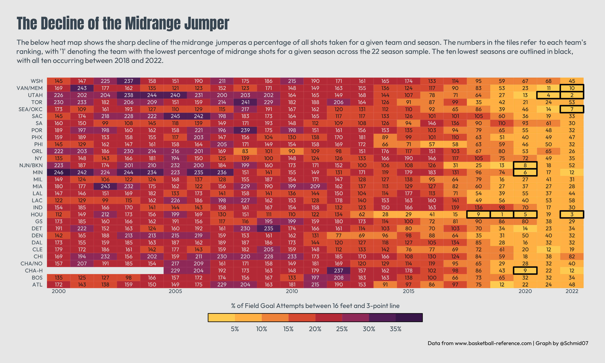

## Decline of the Midrange Jumper

[**Code**](https://github.com/schmid07/NBA-R/blob/main/code/08_midrange_heat.R)

This decline has been mostly offset by a large increase in 3-pt FGAs. In his book, the Midrange Theory,
Seth Partnow notes that 66% of shots that were long twos in 2005 had been replaced by 3-pt FGA
in 2020. Partnow notes that the trend from long twos to 3-pt FGA was precipitated by a decline in
shots outside the paint but shorter than 16 ft, with the reduction mostly occurring in postup plays.
He cites two primary factors: 1) the emergence of perimeter oriented big men like KG and Dirk Nowitzki
and 2) rule changes implemented in 2001 and 2004 that allowed for zone defenses and removed hand-checking. With these two changes pushing shooters further away from the basket, the analytic revolution served as a final accelerant toward more 3-pt FGA and fewer midrange shots, with massive efficiencies resulting from shooting a 3-pt shot vs. a long two.

